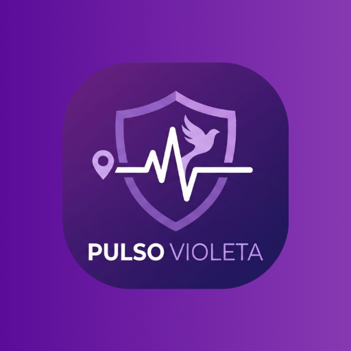

<div align="center">
  <!-- Replace the src with a link to your hosted logo if you have one! -->
  
  
  <h1>💜 Pulso Violeta</h1>
  <p><em>A digital lifeline built for security, reliability, and peace of mind.</em></p>
</div>

---

## 📖 The Mission
In response to the critical challenges surrounding the safety of women in Mexico, **Pulso Violeta** (Violet Pulse) was created as more than just a mobile application—it is an active defense tool. Designed with a focus on immediate emergency response and unwavering reliability, this app provides a discreet, accessible, and failsafe method for women to request help, broadcast their location, and alert trusted contacts the moment they feel unsafe.

## 🛠️ Tech Stack
Architected to be highly responsive and robust, the application utilizes modern mobile and backend frameworks to ensure alerts go through when they matter most.

### Frontend (Mobile Application)
* **Framework:** .NET MAUI 
* **Language:** C#
* **Mapping:** Google Maps API Integration
* **Local Data:** SQLite (Caching & Preferences)
* **Target Platforms:** Android & iOS

### Backend & Database
* **API:** Python / FastAPI
* **Database:** PostgreSQL
* **Architecture:** RESTful API design

## ✨ Key Features
* **🚨 Real-Time S.O.S. Button:** A highly accessible, immediately responsive panic button to trigger emergency workflows.
* **📍 Persistent GPS Tracking:** Continuous, live background location tracking utilizing custom Android Foreground Services.
* **📶 Offline SMS Fallback:** Engineered to bypass internet requirements by dispatching native SMS alerts with coordinates if data connections drop.
* **🛡️ "Immortal" Background Service:** Utilizes Android Wake-Locks and battery-optimization bypasses to guarantee the app remains active and broadcasting during an emergency, even if minimized or locked.

## 🚀 Getting Started

### Prerequisites
* Visual Studio 2022 (with .NET MAUI workload installed)
* Android SDK (API 21+)
* A valid Google Maps API Key

### Installation
1. Clone the repository:
   ```bash
   git clone [https://github.com/YOUR-USERNAME/Pulso-Violeta-MAUI.git](https://github.com/YOUR-USERNAME/Pulso-Violeta-MAUI.git)
